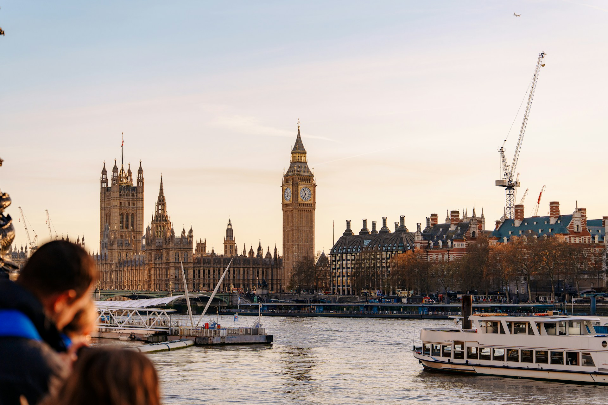

Hello, this is p2!

Link to [p1.md](../p1.md).

Reference page resources:

{fetchpriority="high" loading="eager"}

<!-- fetchpriority and loading: web performance for LCP element -->

Photo by <a href="https://unsplash.com/@duncan2118?utm_source=unsplash&utm_medium=referral&utm_content=creditCopyText">Duncan Adler</a> on <a href="https://unsplash.com/photos/man-siting-on-motorcycle-at-night-Got-SV5YRPg?utm_source=unsplash&utm_medium=referral&utm_content=creditCopyText">Unsplash</a>

This image belongs to the current page's page resources, so the render hook can process it. Open the F12 devtools to inspect the element, and you'll see that srcset has been added correctly.

Photo by <a href="https://unsplash.com/@eduard199x?utm_source=unsplash&utm_medium=referral&utm_content=creditCopyText">Eduard Pretsi</a> on <a href="https://unsplash.com/photos/london-skyline-featuring-big-ben-and-the-river-thames-k-GGACCbyN8?utm_source=unsplash&utm_medium=referral&utm_content=creditCopyText">Unsplash</a>

This image does **not** belong to the current page's page resources, so the render hook only sets a fallback url. Open the F12 devtools to inspect the element, and you'll see there is no srcset.
